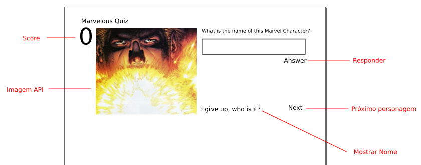

# Desafio de contratação - Desenvolvedor Web Front-end

O desafio é desenvolver um quiz com 10 perguntas com base na API da Marvel Comics.

http://developer.marvel.com/docs

## Interface

1. Imagem de um personagem aleatório vinda da API
2. Input para texto de resposta
3. Pontuação
4. Opção de desistência para usuário ver o nome do personagem na tela (I give up, who is it?)
5. Ser responsivo
6. Aplicar estilo sobre wireframe apresentado.

## Regras de Negócio

1. Caso resposta correta: Somar um ponto
2. Caso resposta incorreta: Subtrai um ponto
3. Caso resposta correta com dica utilizada: Não soma ponto
4. Quando acessado a partir de mobile ser possível compartilhar resultado pelo whatsapp.

## Bônus adicionais

1. Adicionar alguma funcionalidade que você julgue relevante ao Quiz
2. Utilizar Framework (React.js, Vue.js, Angular, etc)
3. Testes de unidade / comportamento
4. Utilizar taskrunners
5. Código padronizado
6. Código comentado com explicações
7. Criar Dockerfile correspondente ao projeto
8. Versionamento utilizando GIT